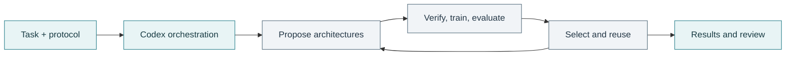

<p align="center">
  
</p>

<p align="center">
  <strong>Codex-driven architecture evolution for recommendation models.</strong><br>
  Read a protocol. Evolve a model. Learn from the results.
</p>

<p align="center">
  <a href="pyproject.toml"></a>
  
  <a href="LICENSE"></a>
</p>

<p align="center">
  <a href="#overview">Overview</a> ·
  <a href="#quick-start">Quick Start</a> ·
  <a href="#experiment-protocols">Protocols</a> ·
  <a href="#data-preparation">Data</a> ·
  <a href="#repository-structure">Structure</a> ·
  <a href="#development">Development</a>
</p>

---

## Overview

**EvoSkillRec turns a Markdown research protocol into a Codex-driven experiment.** Give Codex an objective and a protocol; it checks prerequisites, launches the workflow, handles recoverable failures, and reviews the results.

Each recommendation model is a directed acyclic graph of reusable neural modules called *skills*. The evolution engine searches existing compositions, asks an LLM to propose new modules, and trains and selects candidates using validation metrics. Surviving modules can become reusable skills for later rounds.

| Protocol-driven research | Two search spaces | Three task families |
| :--- | :--- | :--- |
| Codex follows explicit execution and review instructions. | Compose existing skills and generate new PyTorch modules. | CTR prediction, multi-task learning, and multi-domain recommendation. |



> **The entry point is the protocol.** Codex reads `program*.md` and calls the corresponding Python runner. These Markdown files are required project assets. This source-only release excludes datasets, checkpoints, run histories, and previously generated skills.

## Quick start

### 1. Prepare the experiment machine

Use Python **3.10+**, an authenticated Codex installation, and a PyTorch build compatible with your GPUs. The protocols use a conda environment named `rechub`:

```bash
# Run from the repository root. Reuse an existing environment if available.
conda create -n rechub python=3.11 -y
conda run -n rechub python -m pip install -e ".[test]"

export EVOSKILLREC_CODE_SPACE_PROVIDER=codex
export CTR_EVOLUTION_GPU_IDS=0,1
```

Choose GPU IDs that exist on your machine and prepare the [required dataset](#data-preparation). The `codex` executable must also be available and authenticated in the environment used by the Python workflow's provider subprocesses.

<details>
<summary>Check the environment</summary>

```bash
conda run -n rechub python -c \
  "import torch, pandas, sklearn, yaml, recskill; print('Environment ready'); print('CUDA:', torch.cuda.is_available())"
```

Give Codex your environment name, dataset paths, GPU pool, and any budget overrides. Your task instruction takes precedence over protocol defaults. Standard autoresearch protocols expect GPU training and a live provider; request CPU checks or skill-space-only runs explicitly.

</details>

### 2. Give Codex the protocol

Open the repository in Codex on the experiment machine. For **MovieLens CTR**, paste:

```text
Read examples/evolution/program.md in full and execute its autoresearch
protocol using examples/evolution/ctr_movielens_evolution.yaml.

Use the rechub environment, the prepared full dataset, and GPUs 0,1
(CTR_EVOLUTION_GPU_IDS=0,1). Follow the configured evolution budget.
Check prerequisites, launch and monitor the run, and diagnose and retry
recoverable failures according to the protocol.

Write to a fresh directory under outputs/autoresearch/. Review results.tsv
and round_history.tsv, then report the best validation AUC, corresponding
test metrics, failures, and artifact paths. Report hard blockers instead
of changing the dataset or evaluation contract. Execute the workflow
end to end. Do not commit or push.
```

Replace the protocol and YAML with a pair from the [experiment table](#experiment-protocols). Adjust the GPU IDs and paths before starting.

<details>
<summary><strong>Prefer the CLI?</strong> Pass the protocol directly to Codex</summary>

From the repository root:

```bash
# MovieLens CTR
codex exec --cd "$PWD" - < examples/evolution/program.md

# Census multi-task evolution
codex exec --cd "$PWD" - < examples/evolution/program_mtl_census.md
```

For a shared protocol, include the dataset and configuration explicitly:

```bash
CTR_EVOLUTION_GPU_IDS=0,1 codex exec --cd "$PWD" \
  "Follow the attached protocol for MovieLens using examples/evolution/multi_domain_movielens_evolution.yaml. Use rechub and GPUs 0,1. Complete one configured experiment and summarize its results." \
  < examples/evolution/program_multi_domain.md
```

These commands inherit your Codex model and execution permissions. The execution environment needs the filesystem, GPU, subprocess, and network access required by the experiment. Codex interprets the Markdown; the Python runners execute the configured training and evolution workflow.

</details>

### 3. Review the experiment

Codex should report the best validation score, corresponding test metrics, failed candidates, and output paths. Runs are stored under:

```text
outputs/autoresearch/<run-tag>/<experiment-id>/
├── results.tsv        # Candidate metrics, statuses, and generation summaries
├── round_history.tsv  # Baseline and per-generation progress
└── ...                # Optional metadata, diagnostics, and survivor artifacts
```

Selection uses **validation metrics**; test metrics are reported separately. Output flags control additional artifacts, including `summary.json`, which is disabled by default in the MovieLens CTR configuration.

## Experiment protocols

Choose a protocol and its matching configuration. All files below live in `examples/evolution/`.

| Task | Dataset | Protocol | Configuration |
| :--- | :--- | :--- | :--- |
| **CTR** | MovieLens | [Read protocol](examples/evolution/program.md) | [MovieLens CTR](examples/evolution/ctr_movielens_evolution.yaml) |
| **CTR** | Amazon Beauty | [Read protocol](examples/evolution/program_amazon_beauty.md) | [Beauty CTR](examples/evolution/ctr_amazon_beauty_evolution.yaml) |
| **CTR** | Amazon Books | [Read protocol](examples/evolution/program_amazon_books.md) | [Books CTR](examples/evolution/ctr_amazon_books_evolution.yaml) |
| **Multi-task** | Census-Income | [Read protocol](examples/evolution/program_mtl_census.md) | [Census code-space](examples/evolution/mtl_census_codespace.yaml) |
| **Multi-domain** | MovieLens | [Read protocol](examples/evolution/program_multi_domain.md) | [MovieLens multi-domain](examples/evolution/multi_domain_movielens_evolution.yaml) |
| **Multi-domain** | Amazon | [Read protocol](examples/evolution/program_multi_domain.md) | [Amazon multi-domain](examples/evolution/multi_domain_amazon_evolution.yaml) |

The multi-domain protocol is shared: name the dataset and YAML in your Codex task. The Census protocol also describes the [skill-space-only configuration](examples/evolution/mtl_census_evolution.yaml).

<details>
<summary>Example prompts for multi-task and multi-domain experiments</summary>

**Census multi-task**

```text
Read examples/evolution/program_mtl_census.md and execute the Census
multi-task workflow using examples/evolution/mtl_census_codespace.yaml.
Start from the configured AITM genome with live Code-space generation.
Use rechub and GPUs 0,1. Complete the configured experiment, handle
recoverable failures, and report the best validation mean AUC,
corresponding test metrics, and artifact paths.
```

**MovieLens multi-domain**

```text
Read examples/evolution/program_multi_domain.md and execute the MovieLens
workflow using examples/evolution/multi_domain_movielens_evolution.yaml.
Use the configured SARNET genome, rechub, and GPUs 0,1. Complete the
configured experiment and result review. Keep outputs in a fresh
outputs/autoresearch/ directory and preserve the evaluation contract.
```

</details>

<details>
<summary>Default search budgets and baseline comparisons</summary>

| Experiment | Initial model | Rounds | Candidates / round |
| :--- | :--- | ---: | ---: |
| MovieLens CTR | DeepFM | 50 | 10 |
| Amazon Beauty / Books CTR | DeepFM | 25 | 8 |
| Census multi-task with code-space | AITM | 25 | 8 |
| MovieLens multi-domain | SARNET | 25 | 10 |
| Amazon multi-domain | STAR | 25 | 8 |

Adaptive budgets change the allocation between skill-space and code-space while keeping the configured total. Give Codex explicit instructions for shorter runs or different resources.

Baseline runners and multi-run launchers are available in `examples/evolution/`. Ask Codex to inspect their arguments and use them when the task calls for a comparison. Their default output locations are under `outputs/`.

Promoted modules may be written to `recskill/generated_skills/`. Retaining them changes the reusable skill pool, so specify whether the task is an independent experiment or a continuation with skill reuse.

</details>

## How it works

| Component | Role |
| :--- | :--- |
| **Codex task** | Reads the protocol, checks prerequisites, launches and monitors experiments, handles failures, and reviews results. |
| **`program*.md`** | Defines the research objective, data contract, execution procedure, recovery policy, and review criteria. |
| **Experiment YAML** | Sets the initial genome, data paths, training parameters, candidate budgets, and provider commands. |
| **Python runner** | Calls `recskill/evolution/` to generate, verify, train, and select candidates. |
| **LLM provider wrapper** | Plans and synthesizes new modules during code-space evolution. |

The default setup uses Codex in two roles: the **research agent** follows the Markdown protocol, and **code-space provider calls** produce architecture sketches and module implementations. `EVOSKILLREC_CODE_SPACE_PROVIDER=codex` selects the provider for these inner calls. The research workflow begins when you ask Codex to execute a protocol.

<details>
<summary>Runner entry points</summary>

| Task family | Script called by Codex |
| :--- | :--- |
| CTR | [run_ctr_evolution.py](examples/evolution/run_ctr_evolution.py) |
| Multi-task | [run_mtl_evolution.py](examples/evolution/run_mtl_evolution.py) |
| Multi-domain | [run_multi_domain_evolution.py](examples/evolution/run_multi_domain_evolution.py) |

</details>

<details>
<summary>Model selection and alternative code-space providers</summary>

Set `EVOSKILLREC_CODE_SPACE_MODEL` to choose an inner model supported by your backend. If unset, the Codex wrapper leaves model selection to the CLI configuration. The outer research agent's model and the inner code-space model are configured separately.

| Provider | `EVOSKILLREC_CODE_SPACE_PROVIDER` | Additional configuration |
| :--- | :--- | :--- |
| Codex, default | `codex` | Authenticated Codex CLI |
| Gemini | `gemini` | `GEMINI_API_KEY` or `GOOGLE_API_KEY` |
| DeepSeek | `deepseek` | `DEEPSEEK_API_KEY` |
| Custom command | `command` | `EVOSKILLREC_CODE_SPACE_BACKEND` |

[`tools/code_space_llm_provider.py`](tools/code_space_llm_provider.py) reads a JSON prompt on stdin and returns JSON on stdout. The planner returns sketches; the synthesizer returns module proposals.

Stage-specific overrides use `EVOSKILLREC_CODE_SPACE_PLANNER_PROVIDER`, `EVOSKILLREC_CODE_SPACE_SYNTHESIZER_PROVIDER`, the corresponding `*_MODEL` variables, and `*_BACKEND` variables for custom commands. `EVOSKILLREC_CODE_SPACE_TIMEOUT_SEC` controls the provider timeout.

</details>

## Data preparation

Download datasets separately and follow their usage terms. Preparation scripts are included; raw and processed files are ignored by Git. Paths in the supplied YAML files are relative to the repository root. For data stored elsewhere, provide the location to Codex and update the run's `dataset` configuration.

<details>
<summary><strong>MovieLens-1M</strong></summary>

Obtain [MovieLens-1M from GroupLens](https://grouplens.org/datasets/movielens/1m/) and place the extracted `users.dat`, `movies.dat`, and `ratings.dat` in `examples/matching/data/ml-1m/`. Then run:

```bash
python examples/matching/data/ml-1m/preprocess_ml.py
```

This creates `examples/matching/data/ml-1m/ml-1m.csv` with user, movie, rating, timestamp, demographic, and genre columns. The CTR workflow derives `cate_id` from the first genre when it is absent, treats ratings **>= 4** as positive, and uses a chronological **70/10/20** train/validation/test split.

The multi-domain configuration expects the same merged CSV at a different path:

```bash
mkdir -p examples/multi_domain/data/ml-1m
cp examples/matching/data/ml-1m/ml-1m.csv examples/multi_domain/data/ml-1m/ml-1m.csv
```

Alternatively, point `dataset.path` in `multi_domain_movielens_evolution.yaml` to the original CSV. This workflow derives three age-based domains, treats ratings **> 3** as positive, and uses a seeded random **80/10/10** split. Its split and feature settings differ from the CTR experiment.

</details>

<details>
<summary><strong>Census-Income</strong></summary>

Obtain [Census-Income (KDD) from UCI](https://archive.ics.uci.edu/dataset/117/census+income+kdd). Place the decompressed `census-income.data` and `census-income.test` files in `examples/ranking/data/census-income/`, then run:

```bash
(cd examples/ranking/data/census-income && python preprocess_census.py)
```

The script produces `census_income_train.csv`, `census_income_val.csv`, and `census_income_test.csv`. It removes instance weights, encodes categorical features, scales seven continuous features, and constructs two binary labels: `income` and `marital status` (positive for “Never married”). The original training split is retained; the original test split is divided equally into validation and test sets.

The preparation script uses a random validation/test split without a fixed seed. Preserve the prepared files across model comparisons, or set `random_state` in its `train_test_split` call before preparing a reproducible experiment.

</details>

<details>
<summary><strong>Amazon CTR: Beauty and Books</strong></summary>

Place the corresponding headerless rating files, `ratings_Beauty.csv` and `ratings_Books.csv`, in their dataset directories. Each input row must follow the preparation script's column order: `user_id,item_id,rating,time`. Reorder externally obtained files if their schema differs.

```bash
(cd examples/ranking/data/amazon-beauty && python preprocess_amazon_beauty.py)
(cd examples/ranking/data/amazon-books && python preprocess_amazon_books.py)
```

The scripts retain items with at least five ratings and assign a positive label when a rating is at least that user's mean rating. The output columns are `user_id,item_id,time,label`; outputs are named `amazon_beauty_datasets.csv` and `amazon_books_datasets.csv`. The evolution configurations use chronological **70/10/20** splits.

</details>

<details>
<summary><strong>Amazon multi-domain</strong></summary>

Place these line-delimited review JSON files in `examples/multi_domain/data/amazon_5_core/`:

- `reviews_Beauty_5.json`
- `reviews_Clothing_Shoes_and_Jewelry_5.json`
- `reviews_Health_and_Personal_Care_5.json`

Each record must contain `reviewerID`, `asin`, and `overall`. Run:

```bash
(cd examples/multi_domain/data/amazon_5_core && python data_process.py)
```

The output `amazon.csv` contains `user,item,label,domain_indicator`. Domains are encoded as 0, 1, and 2; ratings greater than 3 are positive.

</details>

## Repository structure

```text
EvoSkillRec/
├── examples/
│   ├── evolution/
│   │   ├── program*.md               # Protocols read by Codex
│   │   ├── *.yaml                    # Experiment and launcher configurations
│   │   ├── run_*_evolution.py        # Evolution entry points
│   │   └── *baselines*.py            # Baseline runners and launcher
│   ├── matching/data/                # MovieLens preparation source
│   ├── ranking/data/                 # Census and Amazon CTR preparation
│   └── multi_domain/data/            # Amazon multi-domain preparation
├── recskill/
│   ├── core/                         # Registry, tensor contracts, graph execution
│   ├── skills/                       # Reusable modules and skill manifests
│   ├── genomes/                      # Reference model graphs
│   ├── evolution/                    # Search, verification, training, promotion
│   ├── generated_skills/             # Runtime-generated modules
│   ├── skill_index.json              # Manifest index
│   ├── skill_catalog.json            # Searchable skill metadata
│   └── model_coverage.yaml           # Model-to-skill coverage
├── torch_rechub/                      # Underlying models, layers, and trainers
├── rec_skill_genome/                  # Compatibility entry points
├── tools/                            # LLM wrapper, indexing, search, and audits
├── tests/                            # Core and synthetic-data workflow tests
├── pyproject.toml
└── LICENSE
```

Protocols, skill manifests, reference genomes, and JSON indexes are versioned project assets. Experiment data, generated modules, logs, and checkpoints remain local.

## Development

Core tests use synthetic data and require neither benchmark datasets nor live LLM credentials:

```bash
conda run -n rechub python -m pytest tests/recskill tests/evolution
```

Run all retained tests with `conda run -n rechub python -m pytest`. Optional integrations may require their corresponding dependency groups.

<details>
<summary>Skill indexing, search, and coverage audits</summary>

Run these commands in the installed project environment:

```bash
# Rebuild the manifest index and retrieval catalog.
python tools/build_skill_index.py

# Find reusable modules.
python tools/search_skills.py "feature interaction" --task ctr --limit 5

# Check model coverage and backing implementations.
python tools/audit_model_skill_coverage.py
python tools/audit_torch_rechub_skill_modules.py
```

The index builder includes generated skills when present. Rebuild from a clean generated-skill directory when preparing a source-only release.

</details>

## License and attribution

EvoSkillRec includes code derived from [Torch-RecHub](https://github.com/datawhalechina/torch-rechub). The original Datawhale copyright and [MIT license](LICENSE) are preserved. Dataset usage is governed by the respective providers.

<p align="right"><a href="#overview">Back to overview ↑</a></p>
